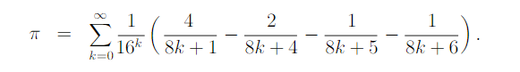

# CALCULATE PI
## Algorithms for calculation
There is so many algorithms for counting number pi.
for example :

* counting with infinite series like "Nilakantha Series"
* using "Arcsine function" to calculate
* The "Bailey-Borwein-Plouffe" (BBP) algorithm

you can find and read about them in sites like :

* https://www.wikihow.com/Calculate-Pi
* https://www.geeksforgeeks.org/calculate-pi-using-nilkanthas-series/
* https://www.researchgate.net/publication228702113_The_BBP_Algorithm_for_Pi

Most of the algorithms like infinite ones takes a lot time and needs so much calculation and they aren't the optimal way to calculate number pi!

## Algorithms i try
At first i trying to calculate with **nilakantha series**, it was an easy one and you can calculate it with little calculations.

    Nilakantha series is like this:
    3 + 4/(2*3*4) - 4/(4*5*6) + 4/(6*7*8) - ... 

but after i wrote the code for this algorithm i figured it out it doesn't have good accuracy in calculating some digits and doesn't return pi correctly, so it wasn't as good as i thought.

Then i trying to use **BBP**, it's algorithm is like this:

The way that BBP works is to calculates the **nth** digit without calculating the first **n−1 digits**, and to calculate each term of it we can use small, efficient data types so, it actually calculates faster than many other algorithms.

because of the way BBP calculates, the accuracy of its calculation is high in all digits of the pi number, and this made me not face the problem that I encountered when calculating with the nilakantha series.

## Semaphore
A semaphore controls access to a shared resource through the use of a **counter**. what the counter is counting are permits that allow access to the shared resource. Thus, to access the resource, a thread must be granted a permit from the semaphore.it creates access to the resource and whenever the access limit is reached,it keeps the other threads in a queue until each one is done to get access to next thread for doing it's job.

when you make a semaphore you should set the counter for it.

The methods i used consists of:

* **acquire()**:Each thread that wants to use a resource must first call acquire() before accessing the resource to acquire the lock, so threads don't have access to it more than the counter you set. 
* **release()**:When the thread is done with the resource, it must call release() to release lock, so the semaphore figure out that the lock has been released and allow other threads to access the resourse.

Don't forget to write try-catch for working with semaphore's methods because of the **Interrupted exception**!

if you want to read about semaphore you can find some details in this sites:

* https://www.geeksforgeeks.org/semaphore-in-java
* https://www.baeldung.com/java-semaphore

## System time
for showing my system time in the code i use **Calender** library in java.

Actually there is dirfferent ways in java for calculating time. One of this ways is using **Date** and it shows you all the details of the date. a sample input and output from this method:

    input:
    Date currentDate = calendar.getTime();
    output:
    Tue Aug 28 11:10:40 UTC 2018
but i use calender in my code, at first you should build a calender object like this:

    Calendar calendar = Calendar.getInstance();
the output of this is exactly like using Data but, we can get parts of this output seperated using the get() methoud. for example, if we want minute:

    calendar.get(Calendar.MINUTE);
    (the calender here is the object we already made) 

the sites i read about system time is:

* https://www.geeksforgeeks.org/calendar-class-in-java-with-examples/
* https://www.linkedin.com/pulse/how-get-current-system-date-time-javaselenium-while-testing-u%C3%A7ar#:~:text=Using%20the%20Calendar%20class,-The%20Calendar%20class&text=Here%20is%20an%20example%20of%20how%20to%20use%20the%20Calendar,getTime()%3B%20String%20currentDateTime%20%3D%20currentDate.
